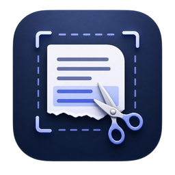

# TextSnipper



TextSnipper is a source-available native macOS menu bar app for fast offline OCR and QR capture from any selected screen region.

Select a region, and TextSnipper copies recognized screen text or a QR code payload to your clipboard.

> Status: early source-available build. Commercial resale or paid redistribution is not permitted without written permission.

## Features

- Fast local OCR for selected screen text
- Automatic multilingual OCR, including Apple Vision-supported languages and additional scripts such as Hindi and Tamil when local language data is available
- QR code detection from the same snipping flow
- Menu bar control after the first setup window
- Escape cancellation while selecting or processing a snip
- Offline processing with no analytics or network requests
- Native macOS app built with SwiftUI, Vision, and ScreenCaptureKit

## Usage

1. Open TextSnipper.
2. Complete the first-run permissions setup.
3. Use the menu bar icon or press `Shift + Command + 2`.
4. Drag over text or a QR code.
5. The result is copied to the clipboard.

TextSnipper automatically runs multilingual OCR. It uses Apple's local Vision OCR for supported languages and can also use local Tesseract language data for additional scripts such as Hindi and Tamil when available.

For Tamil, Hindi, and other scripts not supported by Apple Vision on your macOS version, install Tesseract and the matching `.traineddata` files locally. TextSnipper checks common Homebrew paths automatically.

Press `Escape` to cancel a snip if you selected the wrong area or the task is taking too long.

If you hide the menu bar icon, open Settings again by pressing your snip shortcut, then pressing `Command + ,` while the snipping overlay is visible.

## Download

Download `TextSnipper-macOS.zip` from the GitHub Releases page.

TextSnipper is not currently notarized with an Apple Developer ID. macOS may show a security warning the first time you open the downloaded app.

## Install on macOS

1. Download `TextSnipper-macOS.zip`.
2. Unzip the file.
3. Move `TextSnipper.app` to Applications.
4. Right-click `TextSnipper.app` and choose **Open**.
5. If macOS blocks it, open **System Settings -> Privacy & Security** and choose **Open Anyway** for TextSnipper.

Do not disable Gatekeeper globally.

## Permissions

TextSnipper needs:

- **Screen Recording** to capture the region you select.
- **Accessibility** to support global shortcuts and overlay interactions.

The setup window appears only for first-run setup. After that, use the menu bar item to snip, open Settings, recheck permissions, or quit.

## Build from Source

Requirements:

- macOS with Xcode installed
- Git

Clone and package a local unsigned build:

```bash
git clone https://github.com/mr-rafiq/TextSnipper.git
cd TextSnipper
./scripts/package-macos-open-source.sh
```

The unsigned release archive is created at:

```text
release/TextSnipper-macOS.zip
```

For development:

```bash
open TextSnipper.xcodeproj
```

Run the app from Xcode with `Command + R`.

## Privacy

TextSnipper uses Apple's local Vision framework. Screen captures are processed on your Mac and copied to your clipboard. The app does not upload captures, OCR text, QR payloads, or usage analytics.

## Author

TextSnipper is developed by Mohamed Rafiq.

Website: [www.rafiq.tech](https://www.rafiq.tech)

## Security

Please report security concerns privately using [SECURITY.md](SECURITY.md).

## License

TextSnipper is released under a [non-commercial source license](LICENSE). You may view, modify, and share it for non-commercial purposes, but you may not sell it or include it in paid products or services without written permission.
